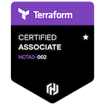
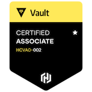

# 💫 About Me:
Enthusiastic about DevOps and logical problem-solving, good in analytics, and loves contributing to open source tools 

## 🌐 Socials:
  

### Certifications:
       

# 💻 Tech Stack:
                                            
# 📊 GitHub Stats:
 
 

## 🏆 GitHub Trophies

### ✍️ Random Dev Quote

### 🔝 Top Contributed Repo

---

<!-- Proudly created with GPRM ( https://gprm.itsvg.in ) -->